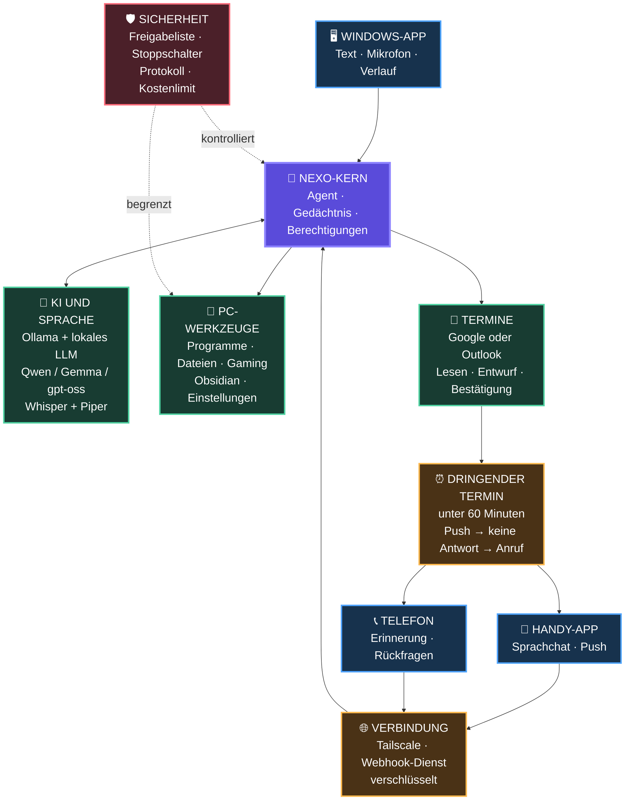

 NEXO – große Systemübersicht

> [!tip] Ansicht
> Öffne die **Leseansicht**. Die Grafik verwendet absichtlich große Schrift und darf breiter als das Notizfenster sein. Falls nötig, kannst du horizontal scrollen oder mit `Strg` + `+` die gesamte Obsidian-Ansicht vergrößern.

## So liest du die Grafik

1. Du sprichst oder schreibst über die Windows-App, die Handy-App oder einen Telefonanruf.
2. Alles läuft im **NEXO-Kern** zusammen.
3. Das lokale Sprachmodell über **Ollama** versteht den Auftrag.
4. NEXO verwendet ein freigegebenes Werkzeug für Windows, Dateien, Obsidian oder Kalender.
5. Die Sicherheitsregeln entscheiden, ob NEXO sofort handeln darf oder zuerst nachfragen muss.
6. Bei einem neuen Termin in weniger als 60 Minuten kommt zuerst eine Push-Nachricht und danach bei ausbleibender Antwort ein Anruf.

> [!important] Noch nicht festgelegt
> Ob Qwen, Gemma oder gpt-oss verwendet wird, entscheidet ein Test mit deiner Grafikkarte. Die restliche Architektur bleibt bei einem Modellwechsel gleich.

