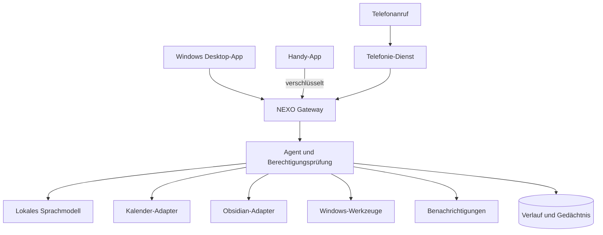
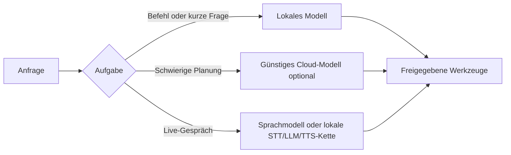

# Systemarchitektur

## Überblick

## Bausteine

### 1. NEXO Gateway

Ein kleiner Dienst auf dem Gaming-PC. Er nimmt Anfragen der Desktop- und Handy-App an, verwaltet Sitzungen und leitet nur erlaubte Aktionen weiter. Für den ersten Prototyp eignet sich Python mit FastAPI.

### 2. Agent und Werkzeugschicht

Das Sprachmodell entscheidet nicht direkt über Windows. Es wählt ein klar beschriebenes Werkzeug aus. Die Werkzeugschicht prüft Parameter, Berechtigung, Bestätigung und Ergebnis.

Beispiele:

- `open_application(app_id)`
- `search_files(query, folders)`
- `draft_calendar_event(title, start, duration)`
- `confirm_calendar_event(draft_id)`
- `create_obsidian_note(path, content)`
- `set_volume(percent)`

### 3. Lokales Modell

Ollama stellt auf Windows eine lokale Schnittstelle bereit und kann die GPU nutzen. Die Modellwahl hängt vor allem vom Grafikspeicher ab. Ein lokales Modell erzeugt keine Tokenrechnung, kostet aber Strom und benötigt genügend RAM beziehungsweise VRAM.

### 4. Sprache

- Aktivierungswort: lokal, alternativ Push-to-talk als zuverlässiger Start
- Sprache zu Text: `whisper.cpp` oder `faster-whisper`
- Text zu Sprache: zunächst Piper; später natürlichere Cloud-Stimme als Option
- Gespräch im Handy: zunächst innerhalb der App über verschlüsselte Audioverbindung

### 5. Desktop-App

Tauri ist eine gute Zielplattform, weil die App klein bleiben kann und Windows-Funktionen über einen lokalen Dienst erreicht. Der erste Prototyp kann zunächst eine lokale Weboberfläche sein.

### 6. Handy-App

Flutter erlaubt Android und iOS aus einer gemeinsamen Codebasis. Für einen schnellen Test reicht zunächst eine installierbare Web-App. Für zuverlässige Push-Nachrichten und Hintergrundfunktionen folgt die native App.

### 7. Verbindung von unterwegs

Für den Anfang kann ein privates Gerätenetz wie Tailscale PC und Handy verbinden. Kalender-Webhooks benötigen jedoch einen öffentlich erreichbaren HTTPS-Endpunkt. Dafür reicht später ein sehr kleiner Cloud-Dienst, der nur Ereignisse annimmt und verschlüsselt an NEXO weitergibt.

## Datenhaltung

- Einstellungen und Aktionsverlauf: lokale SQLite-Datenbank
- Wissensnotizen: Obsidian-Markdown-Dateien
- Geheimnisse: Windows-Anmeldeinformationsverwaltung, nie in Obsidian
- Langzeitgedächtnis: nur bestätigte Fakten, mit Quelle und Löschfunktion

## Modell-Routing

Das System bekommt eine austauschbare Modellschnittstelle. Dadurch kann später zwischen lokalem Modell, günstigem Cloud-Modell und hochwertigem Sprachmodell gewechselt werden, ohne die Apps neu zu bauen.
