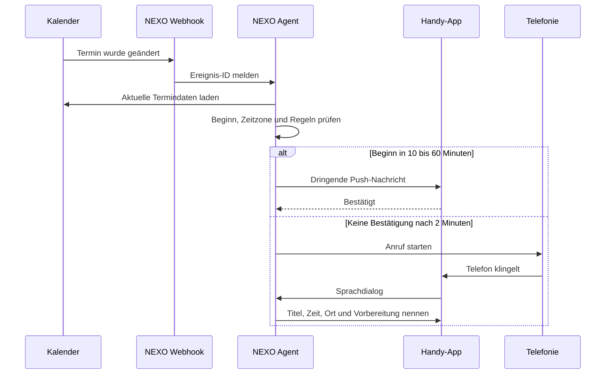

# Termin-und-Anruf-Ablauf

## Gewünschtes Verhalten

Wenn ein neuer oder geänderter Termin erkannt wird und sein Beginn weniger als 60 Minuten entfernt ist, soll NEXO den Nutzer zuverlässig informieren. Ein echter Telefonanruf ist die Eskalationsstufe, weil er Geld kostet und störender ist als eine Push-Nachricht.

## Regel in verständlicher Form

1. Reagiere nur auf neu angelegte oder wesentlich geänderte Termine.
2. Lade den vollständigen Termin, da die Kalenderbenachrichtigung allein nicht alle Details enthält.
3. Normalisiere Startzeit und Zeitzone.
4. Ignoriere abgesagte, ganztägige und bereits begonnene Termine, sofern keine eigene Regel gilt.
5. Wenn der Termin in 10 bis 60 Minuten beginnt, sende sofort eine Push-Nachricht.
6. Wenn der Nutzer innerhalb von zwei Minuten bestätigt, ist der Vorgang beendet.
7. Wenn keine Bestätigung kommt und „Anruf-Eskalation“ aktiv ist, starte genau einen Anruf.
8. Lege eine Sperre pro Termin an, damit Änderungen nicht zu mehreren Anrufen führen.
9. Im Anruf darf NEXO Termindetails erklären und eine Erinnerung verschieben. Änderungen am Termin brauchen eine Bestätigung.

## Sonderfälle

- Ein Termin wird für „jetzt“ eingetragen: sofort Push, Anruf nach 30 Sekunden.
- Mehrere dringende Termine: in einer Nachricht und einem Anruf zusammenfassen.
- PC ist aus: kleiner Cloud-Dienst oder die Handy-App übernimmt die Regel.
- Kein Netz: lokale Handy-Benachrichtigung, sobald der Kalender auf dem Gerät synchronisiert wurde.
- Unbekannte Zeitzone: keine automatische Aktion, stattdessen Rückfrage.
- Wiederholte Kalender-Webhooks: Ereignis-Version und Sperrschlüssel verhindern Duplikate.

## Technischer Hinweis

Google Calendar kann Änderungen per Push-Benachrichtigung an einen HTTPS-Webhook melden. Die Benachrichtigung signalisiert eine Änderung; NEXO muss anschließend die aktuellen Ereignisdaten abrufen. Für Outlook wäre das entsprechende Gegenstück Microsoft Graph Change Notifications.
